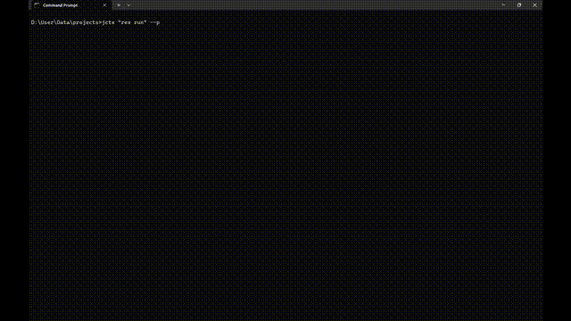

# Jctx — Give AI full understanding of your Java, Kotlin & Python codebase

**Stop pasting files. Get real architecture-aware answers.**

**Generate complete project context in seconds.**

**Turn any Java, Kotlin, or Python project into a single AI-ready `context.txt` (or `context.md`) in seconds.**

```
Jctx "C:\projects\MyApp"
→  context.txt written  (Java: 39 files | Kotlin: 12 files | Python: 15 files | POM: 1 file | Gradle: 1 file)
```

No config. No dependencies. Just Python and a folder.

---

## Why it exists

You're working on a Java, Kotlin, or Python project. You open an AI chat to get help. Before you can even ask your question, you spend 10 minutes copy-pasting files, explaining your class structure, summarising what each module does.

**Before:**
ChatGPT suggests random classes

**After:**
ChatGPT tells exactly which class to modify and why

**Jctx does all of that in one command.**

It scans your project and writes a clean, structured `context.txt` (or `context.md`) — every class, every field, every method signature, every Javadoc/KDoc/docstring comment, and your build files — formatted so an AI can immediately understand your entire codebase.

It also provides **Token Count Estimation**, **Language Percentages**, and a **Dependency Graph** — all printed to your console automatically.

Paste it. Ask your question. Get useful answers.

---

## Output (real example)

<details>
<summary>Click to expand sample context.txt (Plain Text - Default)</summary>

```text
================================================================
 JCTX v2.1.0 - Java, Kotlin & Python Context Extractor
 Project : C:\projects\Talken
 Date    : 2026-03-31 12:00:00
 Files   : Java: 39 file(s) | Kotlin: 5 file(s) | Python: 2 file(s) | POM: 1 file(s) | Gradle: 1 file(s)
================================================================

================================================================
 SECTION 1 - PROJECT FILE TREE
================================================================

  Talken\
  ├── src\
  │   └── main\
  │       ├── java\
  │       │   └── org\
  │       │       └── flexstudios\
  │       │           └── talken\
  │       │               ├── Controls.java
  │       │               └── TalkenClient.java
  │       └── kotlin\
  │           └── org\
  │               └── flexstudios\
  │                   └── talken\
  │                       └── UserProfile.kt
  ├── build.gradle
  └── pom.xml

================================================================
 SECTION 2 - POM.XML CONTENT
================================================================

----------------------------------------------------------------
  FILE: pom.xml
----------------------------------------------------------------

  <?xml version="1.0" encoding="UTF-8"?>
  <project>
      <modelVersion>4.0.0</modelVersion>
      <groupId>org.flexstudios</groupId>
      <artifactId>talken</artifactId>
      <version>1.0.0</version>
  </project>

================================================================
 SECTION 3 - KOTLIN CLASS AND MEMBER DETAILS
================================================================

----------------------------------------------------------------
  FILE: src\main\kotlin\org\flexstudios\talken\UserProfile.kt
----------------------------------------------------------------

  CLASS: UserProfile
  DOC  : Represents the user's local profile settings.

  DATA MEMBERS:
    · private val String displayName
    · private val String email

  METHODS:
    [1] String getAboutSection()
         DOC: (no documentation)

================================================================
 END OF REPORT
================================================================
```

</details>

---

## Install

**Option 1: PyPI (Recommended)**
The easiest way to install Jctx on any OS (Windows, macOS, Linux) is via pip:
```bash
pip install jctx
```
The `jctx` command will be instantly available in your terminal.

**Option 2: Manual Download (Windows)**
1. Download The Latest **Release** Zip.
2. Unzip it
3. Right-click `Setup.bat` → **Run as administrator**
4. Open a new terminal

```bat
jctx "C:\path\to\your\java\project"
```

> **No admin rights?** Copy `jctx.py` + `jctx.bat` anywhere and run `jctx.bat` directly.

> **Not on Windows?** Run `python jctx.py "path/to/project"` on any OS with Python 3.8+.

---

## Usage

```
Jctx <project_folder> [--md] [--slim] [--no-tree] [--clipboard] [--print] [--version] [--help]
```

| Flag | Effect |
|---|---|
| *(none)* | Saves `context.txt` into your project folder and prints token estimates |
| `--md` | Outputs a cleanly formatted Markdown file (`context.md`) instead of plain text |
| `--slim` | Slim mode: output only class names and method signatures (omits fields and docs) to save tokens |
| `--no-tree` | Skips the file tree section (shorter output) |
| `--clipboard` | Copies the generated report directly to your clipboard |
| `--print` | Also prints to the console |
| `--version` | Shows the Jctx version |
| `--help` | Shows help |

---

## How to use the output

Paste `context.txt` (or the contents of `context.md`) into any AI chat and ask your question:

> *"Here's my Java/Kotlin/Python project structure: [paste]. I want to refactor the messaging module to use WebSockets — where should I start?"*

Works great with **Claude**, **ChatGPT**, **Gemini**, and any other AI that accepts long text input.

---

## Console Metrics

After generating the file, Jctx prints a full analytics dashboard to your console:

### Language Percentages

Shows the exact split of Java vs Kotlin vs Python code by lines of code:

```text
================================================================
 LANGUAGE PERCENTAGES
================================================================
  Java    :  60.2%  ██████████████████████████████░░░░░░░░░░░░░░░░░░░░  (4,120 lines)
  Kotlin  :  28.1%  ██████████████░░░░░░░░░░░░░░░░░░░░░░░░░░░░░░░░░░░░  (1,920 lines)
  Python  :  11.7%  █████░░░░░░░░░░░░░░░░░░░░░░░░░░░░░░░░░░░░░░░░░░░░░  (800 lines)
================================================================
```

### Dependency Graph

Automatically maps which of your project classes depend on which — scans both import statements and in-body type references (catches same-package dependencies too). Only shows project-internal references, no external library noise:

```text
================================================================
 DEPENDENCY GRAPH (project-internal)
================================================================
  EncryptionModule → (none)
  MessagingModule → EncryptionModule, UserProfile
  TalkenClient → EncryptionModule, MessagingModule, UserProfile
  UserProfile → (none)
================================================================
```

### Token Count Estimate

Shows the total token count with a breakdown by section and checks whether your context fits each major AI model's context window:

```text
================================================================
 TOKEN ESTIMATE
================================================================
  Total tokens : ~34,767

  Language Breakdown:
    Java        : ~  23,400  ( 59.3%)
    Kotlin      : ~  10,910  ( 27.6%)
    Python      : ~   4,560  ( 11.6%)
    Build files : ~     290  (  0.7%)
    File tree   : ~     312  (  0.8%)

  Context Window Fit:
    Y Llama 4 Scout (10M)      Y Gemini 3.1 (2M)          Y Grok (2M)
    Y GPT-5.4 (1M)             Y Claude 4.6 (1M)          Y Qwen 3 (1M)
================================================================
```

---

## `.jctxignore` — Custom Exclusions

Place a `.jctxignore` file in the project root to exclude additional directories or files from context extraction:

```gitignore
# Skip test directories
**/test/**

# Skip generated code
generated/

# Skip specific file patterns
*.test.java
```

| Pattern | Meaning |
|---------|---------|
| `dirname/` | Skip any directory named `dirname` |
| `**/test/**` | Skip any directory named `test` anywhere in the tree |
| `*.test.java` | Skip files matching the glob pattern |
| `# comment` | Lines starting with `#` are ignored |

When a `.jctxignore` is detected, the console banner shows:
```
  .jctxignore: yes (2 dirs, 1 patterns)
```

---

## What it extracts

| What | Detail |
|---|---|
| File tree | Full project structure, build folders excluded |
| Build Files | Full content of your `pom.xml`, `build.gradle`, `requirements.txt`, and `pyproject.toml` |
| Classes | Java/Kotlin classes and interfaces, Python classes, plus all docstrings/JavaDocs/KDocs |
| Fields | Type, name, access modifier, val/var (Kotlin), instance vars (`self.x`), inline comments |
| Methods | Numbered list — return type, name, params, decorators, top-level Python/Kotlin functions |

**Auto-ignored:** `build/`, `target/`, `.idea/`, `.git/`, `node_modules/`, `.gradle/`, `.class`, `.jar`, and all other build artifacts. Customize further with `.jctxignore`.

---

## Requirements

- Python 3.8 or newer — [python.org](https://python.org)
- Works on Windows, macOS, Linux

---

## GitHub Actions — Automatic Context Reports

Jctx ships with a ready-made GitHub Actions workflow that automatically generates a context report on every push or pull request, saving you from running the tool manually.

### What the workflow does

1. **Checks out** your repository.
2. **Installs Jctx** from PyPI (with pip caching so repeated runs are fast).
3. **Runs `jctx`** on your project and prints the analytics dashboard to the Actions log.
4. **Uploads** the generated `context.md` (or `context.txt`) as a downloadable workflow artifact (retained for 30 days).
5. **Comments** a preview of the report on the pull request (when triggered by `pull_request`). Subsequent pushes to the same PR update the existing comment instead of creating a new one.
6. **Optionally commits** the report back to the repository (disabled by default; see configuration below).

---

### Quick start — copy the workflow into your own repository

```bash
# From the root of your repository:
mkdir -p .github/workflows
curl -o .github/workflows/jctx-context-report.yml \
  https://raw.githubusercontent.com/Shashwat-Gupta57/Jctx/main/.github/workflows/jctx-context-report.yml
```

Then commit and push. The workflow will run on your next push.

---

### Configuration

All options are controlled via **repository variables** (Settings → Secrets and variables → Variables → New repository variable). No workflow file edits are needed.

| Variable | Default | Description |
|---|---|---|
| `JCTX_PROJECT_PATH` | `.` | Path to the project folder to analyse, relative to the repo root. Example: `./my-java-app` |
| `JCTX_OUTPUT_FORMAT` | `md` | Output format: `md` (Markdown) or `txt` (plain text). |
| `JCTX_SLIM_MODE` | `false` | Set to `true` to use slim mode (class names + method signatures only). |
| `JCTX_NO_TREE` | `false` | Set to `true` to omit the file-tree section. |
| `JCTX_COMMIT_REPORT` | `false` | Set to `true` to automatically commit the report back to the repo (see below). |
| `JCTX_COMMIT_PATH` | `docs/context-report` | Folder where the committed report is stored (only used when `JCTX_COMMIT_REPORT=true`). |

#### Committing the report back to the repository

To enable automatic commits of the generated report:

1. Set the repository variable `JCTX_COMMIT_REPORT` to `true`.
2. Add `contents: write` to the workflow permissions (edit the `permissions:` block in the workflow file):

```yaml
permissions:
  contents: write        # needed to commit the report
  pull-requests: write   # needed for PR comments
```

The commit message is `chore: update Jctx context report [skip ci]` (the `[skip ci]` tag prevents the commit from triggering another workflow run).

#### Required permissions

| Feature | Permission needed |
|---|---|
| Artifact upload | *(none — included by default)* |
| PR comment | `pull-requests: write` *(already set in the workflow)* |
| Commit report | `contents: write` *(must be added manually if you enable `JCTX_COMMIT_REPORT`)* |

---

### Using the reusable composite action

If you prefer a more modular approach, use the composite action directly in your own workflow:

```yaml
jobs:
  context:
    runs-on: ubuntu-latest
    steps:
      - uses: actions/checkout@v4

      - name: Generate Jctx context report
        id: jctx
        uses: Shashwat-Gupta57/Jctx/.github/actions/generate-context@main
        with:
          project-path: '.'        # folder to analyse
          output-format: 'md'      # 'md' or 'txt'
          slim: 'false'            # 'true' for slim mode
          no-tree: 'false'         # 'true' to skip file tree
          # jctx-version: '2.1.0' # pin a specific version (optional)

      - name: Upload report
        uses: actions/upload-artifact@v4
        with:
          name: context-report
          path: ${{ steps.jctx.outputs.report-path }}
```

**Action inputs**

| Input | Default | Description |
|---|---|---|
| `project-path` | `.` | Project folder to analyse. |
| `output-format` | `md` | `md` or `txt`. |
| `slim` | `false` | Slim mode (class names + signatures only). |
| `no-tree` | `false` | Omit file-tree section. |
| `jctx-version` | *(latest)* | Pin a specific PyPI version of jctx. |

**Action outputs**

| Output | Description |
|---|---|
| `report-path` | Path to the generated report file inside the runner workspace. |

---

### More GitHub Actions ideas

Here are additional ways to integrate Jctx (and GitHub Actions in general) to make your workflow even more powerful:

| Idea | How |
|---|---|
| **Scheduled context snapshots** | Add a `schedule` trigger (see example below the table) to generate a weekly context report automatically. |
| **Publish to GitHub Pages** | Use `actions/deploy-pages` to host the latest `context.md` as a browsable site for the project. |
| **Generate a changelog** | Combine Jctx with tools like [`git-cliff`](https://github.com/orhun/git-cliff) or [`release-drafter`](https://github.com/release-drafter/release-drafter) to auto-create changelogs on release. |
| **Release automation** | Trigger a release workflow on version-tag pushes (`v*`) that publishes to PyPI or GitHub Releases and attaches the context report as a release asset. |
| **PR labeling** | Use `actions/labeler` to automatically label PRs based on which files changed (e.g., `java`, `kotlin`, `python`). |
| **Security scanning** | Add `github/codeql-action` to scan your Java/Kotlin/Python source files for vulnerabilities on every push. |
| **Dependency review** | Use `actions/dependency-review-action` on PRs to catch newly introduced vulnerable dependencies. |
| **Issue/PR templates validation** | Enforce PR descriptions with a custom action that checks the PR body against a template. |
| **Stale issue management** | Use `actions/stale` to automatically close issues and PRs that have been inactive for a configurable number of days. |
| **Notify on Slack/Discord** | Send a webhook notification with a link to the generated context report artifact after each run. |
| **Matrix builds** | Run Jctx across multiple project sub-folders in a single workflow using a matrix strategy. |

Example — weekly scheduled run (add to the `on:` block of the workflow):

```yaml
on:
  schedule:
    - cron: '0 0 * * 1'   # every Monday at midnight UTC
  push:
    branches: ['**']
  workflow_dispatch:
```

---

## Roadmap

- [x] Kotlin support
- [x] Markdown output mode (`context.md`)
- [x] Multi-language project estimations (mixed Java + Kotlin percentages)
- [x] Token count estimate alongside output
- [x] Clipboard support and Slim mode
- [x] Dependency graph (project-internal)
- [x] `.jctxignore` custom exclusions
- [x] Cross-platform packaging (PyPI / pip)
- [x] Python language support
- [ ] Architecture diagram generation (`--diagram`)

---

## License

MIT — free to use, modify, and share.
