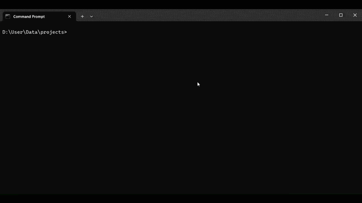

# Jctx — Give AI full understanding of your Java codebase

**Stop pasting files. Get real architecture-aware answers.**

**Generate complete project context in seconds.**

**Turn any Java project into a single AI-ready `context.txt` in seconds.**

```
Jctx "C:\projects\MyApp"
→  context.txt written  (39 files, 12 classes, 247 methods)
```

No config. No dependencies. Just Python and a folder.

---

## Why it exists

You're working on a Java project. You open an AI chat to get help. Before you can even ask your question, you spend 10 minutes copy-pasting files, explaining your class structure, summarising what each module does.

**Before:**
ChatGPT suggests random classes

**After:**
ChatGPT tells exactly which class to modify and why

**Jctx does all of that in one command.**

It scans your project and writes a clean, structured `context.txt` — every class, every field, every method signature, every Javadoc comment — formatted so an AI can immediately understand your entire codebase.

Paste it. Ask your question. Get useful answers.

---

## Output (real example)

<details>
<summary>Click to expand sample context.txt</summary>

```
================================================================
 JCTX - Java Context Extractor
 Project : C:\projects\Talken
 Date    : 2026-03-28 14:22:01
 Java    : 39 file(s)   |   POM: 1 file(s)
================================================================

================================================================
 SECTION 1 - PROJECT FILE TREE
================================================================

  Talken\
  ├── src\
  │   └── main\
  │       └── java\
  │           └── org\
  │               └── flexstudios\
  │                   └── talken\
  │                       ├── Controls.java
  │                       ├── TalkenClient.java
  │                       ├── MessagingModule.java
  │                       ├── EncryptionModule.java
  │                       └── UserProfile.java
  └── pom.xml

================================================================
 SECTION 2 - CLASS AND MEMBER DETAILS
================================================================

----------------------------------------------------------------
  FILE: src\main\java\org\flexstudios\talken\UserProfile.java
----------------------------------------------------------------

  CLASS: UserProfile

  DATA MEMBERS:
    · private String displayName
    · private String email
    · private String aboutSection
    · private String profilePfpID
    · private int version

  METHODS:
    [1] void setDisplayName(String s)
         DOC: (no documentation)

    [2] String getDisplayName()
         DOC: (no documentation)

    [3] void setEmail(String email)
         DOC: (no documentation)

    [4] String getAboutSection()
         DOC: (no documentation)

    [5] int getVersion()
         DOC: (no documentation)

----------------------------------------------------------------
  FILE: src\main\java\org\flexstudios\talken\MessagingModule.java
----------------------------------------------------------------

  CLASS: MessagingModule

  DATA MEMBERS:
    · private static final int port
    · private static EventLoopGroup bossGroup
    · private static boolean isRunning

  METHODS:
    [1] void start(String ip)
         DOC: (no documentation)

    [2] CompletableFuture<Boolean> askRUO(InetSocketAddress recipient)
         DOC: (no documentation)

    [3] void sendMessage(String message, InetSocketAddress recipient)
         DOC: (no documentation)
```

</details>

---

## Install (Windows)

**One-time Setup:**

1. Download The Latest **Release** Zip.
2. Unzip it
3. Right-click `Setup.bat` → **Run as administrator**
4. Open a new terminal

```bat
Jctx "C:\path\to\your\java\project"
```

That's it. `context.txt` appears inside your project folder.

> **No admin rights?** Copy `Jctx.py` + `Jctx.bat` anywhere and run `Jctx.bat` directly.

> **Not on Windows?** Run `python Jctx.py "path/to/project"` on any OS with Python 3.8+.

---

## Usage

```
Jctx <project_folder> [--no-tree] [--print] [--help]
```

| Flag | Effect |
|---|---|
| *(none)* | Saves `context.txt` into your project folder |
| `--no-tree` | Skips the file tree section (shorter output) |
| `--print` | Also prints to the console |
| `--help` | Shows help |

---

## How to use the output

Paste `context.txt` into any AI chat and ask your question:

> *"Here's my Java project structure: [paste]. I want to refactor the messaging module to use WebSockets — where should I start?"*

Works great with **Claude**, **ChatGPT**, **Gemini**, and any other AI that accepts long text input.

---

## What it extracts

| What | Detail |
|---|---|
| File tree | Full project structure, build folders excluded |
| Classes | Name + Javadoc |
| Fields | Type, name, access modifier, inline comments |
| Methods | Numbered list — return type, name, params, Javadoc |
| pom.xml | Full content if present |

**Auto-ignored:** `build/`, `target/`, `.idea/`, `.git/`, `node_modules/`, `.class`, `.jar`, and all other build artifacts.

---

## Requirements

- Python 3.8 or newer — [python.org](https://python.org)
- Works on Windows, macOS, Linux

---

## Roadmap

- [ ] Kotlin support
- [ ] Markdown output mode (`context.md`)
- [ ] Multi-language projects (mixed Java + Kotlin)
- [ ] Token count estimate alongside output

---

## License

MIT — free to use, modify, and share.
